# How the AI Development Process Works

1. **Idea Stage:**
    - Come up with a clear idea of what you want to build.

2. **Feature Request:**
    - Write a detailed feature request.
    - Explain what you want to achieve, list the required files, classes, and how they connect with each other.

3. **Step-by-Step Plan:**
    - Ask the AI for a detailed, step-by-step plan on how to implement your idea.

4. **Iteration 1:**
    - **Prepare Context:**
        - Provide the AI with the initial context it needs, like the existing code or any important details.
    - **Ask for Code:**
        - Request the AI to write interfaces and the necessary Data Transfer Objects (DTOs).
    - **Save Files:**
        - Save the new files into your project.
    - **Refactor:**
        - Do any needed clean-up, like fixing namespaces or splitting code into extra services if necessary.

5. **Iteration 2:**
    - **Update Context:**
        - Provide the AI with the updated context that now includes the new files.
        - Start to remove any parts that are no longer needed.
    - **New Code Portions:**
        - Based on the plan, ask the AI to create additional classes and services.
    - **Refactor Again:**
        - Refine the code as needed (for example, adjust namespaces or further split services).

6. **Further Iterations:**
    - Repeat the above steps, gradually building and improving the code with each iteration.

7. **Final Iteration:**
    - **Commit and PR Text:**
        - Ask the AI to generate a commit message and pull request (PR) description based on the code or feature
          request.
    - **Final Refactoring:**
        - Do one last round of refactoring if necessary.
    - **Testing:**
        - Write tests to make sure everything works correctly.

This process helps you work with AI in small, manageable steps, making it easier to build, review, and improve your
code.

```mermaid
flowchart TD
    A[Idea Stage: Come up with what you want to build]
    B[Feature Request: Write detailed FR with file structure, classes, and connections]
    C[Plan: Ask AI for a step-by-step implementation plan]
    D1[Iteration 1: Prepare initial context: existing code, details]
    D2[Iteration 1: Ask AI for interfaces & DTOs]
    D3[Iteration 1: Save new files in project]
    D4[Iteration 1: Refactor code: fix namespaces, split into services]
    decision1{Need more iterations?}
    E1[Iteration: Update context with new files and remove unneeded parts]
    E2[Iteration: Ask AI for new classes & services]
    E3[Iteration: Refactor code as needed]
    decision2{Code complete and working?}
    decisionCommit{Need commit text?}
    F1[Final Iteration: Ask AI for commit message & PR text]
    F2[Final Iteration: Final refactoring: namespaces, services]
    F3[Final Iteration: Write tests]
    decisionFeature{Need resulting feature outlines?}
    G1[Generate resulting feature outlines]
    End[End Process]

    A --> B
    B --> C
    C --> D1
    D1 --> D2
    D2 --> D3
    D3 --> D4
    D4 --> decision1
    decision1 -- Yes --> E1
    E1 --> E2
    E2 --> E3
    E3 --> decision2
    decision2 -- No --> E1
    decision2 -- Yes --> decisionCommit
    decisionCommit -- Yes --> F1
    decisionCommit -- No --> F2
    F1 --> F2
    F2 --> F3
    F3 --> decisionFeature
    decisionFeature -- Yes --> G1
    decisionFeature -- No --> End
    G1 --> End

```



## Project Understanding Phase

### 1. Project Structure Analysis

**Generate Project Tree Structure:**

```bash
ctx --inline='{
  "documents": [{
    "description": "Project Structure Overview",
    "outputPath": "project-structure.md",
    "sources": [{
      "type": "tree",
      "sourcePaths": ["src"],
      "maxDepth": 3,
      "showSize": true,
      "showCharCount": true
    }]
  }]
}'
```

**Review Core Interfaces:**

```bash
ctx --inline='{
  "documents": [{
    "description": "Core Interfaces",
    "outputPath": "core-interfaces.md",
    "sources": [{
      "type": "file",
      "sourcePaths": ["src"],
      "filePattern": "*Interface.php"
    }]
  }]
}'
```

### 2. Project Overview Development

**AI Instruction for Project Description:**

```
Based on the project structure I've shared, please analyze the main components and their relationships. 

Provide:
1. A high-level overview of what this project does
2. The main architectural patterns being used
3. Key dependencies and their purpose
4. How data flows through the system
5. The main use cases the system addresses

Focus on understanding the big picture before diving into specific implementation details.
```

**Extract Critical Code Components:**

```bash
ctx --inline='{
  "documents": [{
    "description": "Critical Components",
    "outputPath": "critical-components.md",
    "sources": [{
      "type": "file",
      "sourcePaths": ["src"],
      "path": ["Core", "Service", "Controller"],
      "filePattern": "*.php"
    }]
  }]
}'
```

**Request for Sequence Diagram:**

```
Based on the code I've shared, please create a sequence diagram showing the flow of a typical request through the s
ystem. Focus on how data moves between the main components we've identified. Include key classes, methods, and the 
order of operations.
```

**Brainstorming Session for Module Understanding:**

```
Let's focus on the [Module Name] component. 

Based on the code we've analyzed:
1. What is this module's primary responsibility?
2. What design patterns is it implementing?
3. How does it interact with other system components?
4. What potential issues or improvements do you see in its current implementation?
5. How might we extend it for new features?
```

**Request for Context Configuration:**

```
Based on our discussion and the code we've analyzed, please create a context configuration that would help me 
efficiently explore this codebase. 

Consider:
1. The core components we need to understand
2. Key interfaces and their implementations
3. Main data structures and models
4. Entry points and controllers
5. Configuration and dependency management

Format it as a ctx inline command with a comprehensive structure.
```

## Feature Development Phase

### 1. Feature Context Gathering

**Feature Scope Definition:**

```
I need to implement a new feature that allows users to export reports in PDF format. 

This will impact:
1. The ReportController class
2. The ReportGenerator service
3. Potentially the data models that represent report data

Let's gather the relevant context and plan this implementation.
```

**AI-Generated Context Query:**

```bash
ctx --inline='{
  "documents": [{
    "description": "Report Generation Context",
    "outputPath": "report-feature.md",
    "sources": [{
      "type": "file",
      "sourcePaths": ["src"],
      "path": ["Report", "Controller", "Service"],
      "contains": ["report", "export", "generate", "pdf"],
      "filePattern": "*.php"
    }]
  }]
}'
```

### 2. Feature Planning

**Feature Brainstorming Instruction:**

```
Based on the context we've gathered on the report system, let's brainstorm approaches for PDF export implementation:
1. What libraries might be appropriate for PDF generation?
2. How should we structure the new PDF export service?
3. What interfaces need to be modified or created?
4. How will this integrate with the existing report flow?
5. What test cases should we consider?

Think through multiple approaches before deciding on a recommendation.
```

**Feature Request Creation:**

```
Please create a formal Feature Request document for the PDF export feature. 

Include:
1. Feature description and business justification
2. Technical approach with proposed changes to existing code
3. New classes/methods to implement
4. Required dependencies or libraries
5. Implementation steps in order
6. Acceptance criteria
7. Potential risks or considerations
```

## Bug Resolution Phase

### 1. Bug Analysis

**Bug Documentation:**

```
We're experiencing an error in the payment processing system. When a user attempts to make a refund, they receive 
a "Transaction state invalid" error. The error occurs in the RefundService.php file. Let's gather context and analyze 
this issue.
```

**Context Request for Bug Analysis:**

```bash
ctx --inline='{
  "documents": [{
    "description": "Payment Refund Bug Context",
    "outputPath": "refund-bug.md",
    "sources": [{
      "type": "file",
      "sourcePaths": ["src/Payment"],
      "contains": ["refund", "transaction", "state", "invalid"],
      "filePattern": "*.php"
    }, {
      "type": "file",
      "sourcePaths": ["tests/Payment"],
      "filePattern": "*Test.php"
    }]
  }]
}'
```

### 2. Bug Resolution Planning

**Bug Issue Creation:**

```
Based on the code context we've gathered, please create a comprehensive Issue document for this refund bug. 

Include:
1. Issue summary and symptoms
2. Root cause analysis
3. Affected components
4. Proposed fix with specific code changes
5. Verification steps to test the fix
6. Prevention measures to avoid similar issues
```

## Domain Entity Management

### 1. Context Preparation for Existing Entities

**Entity Modification Request:**

```
We need to extend the User entity to support two-factor authentication. 

This will require:
1. Adding new fields to the User entity
2. Modifying the UserRepository
3. Creating a new 2FA service
4. Updating relevant factories

Let's gather the context for these changes.
```

**Entity Context Request:**

```bash
ctx --inline='{
  "documents": [{
    "description": "User Entity Context",
    "outputPath": "user-entity.md",
    "sources": [{
      "type": "file",
      "sourcePaths": ["src/Entity", "src/Repository"],
      "contains": ["User", "Authentication"],
      "filePattern": "*.php"
    }]
  }]
}'
```

### 2. Context Preparation for New Entities

**Entity Template Request:**

```bash
ctx --inline='{
  "documents": [{
    "description": "Entity Templates",
    "outputPath": "entity-templates.md",
    "sources": [{
      "type": "file",
      "sourcePaths": ["src/Entity", "src/Repository", "src/Factory"],
      "filePattern": ["*Entity.php", "*Repository.php", "*Factory.php"],
      "path": ["Core"]
    }]
  }]
}'
```

**Entity Relationship Description:**

```
We need to create a new set of entities for our product review system. 

The main entities are:
1. Review - contains the review content, rating, and timestamps
2. ReviewAuthor - information about who wrote the review
3. ReviewAttachment - images or other files attached to reviews
4. ProductReviewCollection - aggregates reviews for a specific product

These entities have the following relationships:
- A Review belongs to one ReviewAuthor
- A Review can have multiple ReviewAttachments
- A ProductReviewCollection contains multiple Reviews for one Product

Let's design these entities and their relationships.
```

**DBML Schema Request:**

```
Based on our discussion of the review system entities, please create a DBML schema that represents:
1. All the required tables
2. Fields with appropriate types
3. Relationships between tables
4. Indexes for performance
5. Any constraints that should be applied

Format it as valid DBML that we could use to generate SQL.
```

## Test Development

**Test Guidelines Request:**

```bash
ctx --inline='{
  "documents": [{
    "description": "Existing Test Examples",
    "outputPath": "test-examples.md",
    "sources": [{
      "type": "file",
      "sourcePaths": ["tests"],
      "filePattern": "*Test.php",
      "notPath": ["Fixtures", "Mock"]
    }]
  }]
}'
```

**Test Guideline Development Instruction:**

```
Based on the test examples I've shared, please analyze our testing approach and create comprehensive testing guidelines. 

Include:
1. Test organization and structure
2. Naming conventions
3. Approach to mocking and fixtures
4. Test coverage expectations
5. Best practices for assertions
6. Testing specific components (services, controllers, entities)
7. Integration vs. unit testing approaches
```

## Starting a New Project

**Project Goals Description:**

```
I'm starting a new project for an e-commerce inventory management system. 

The key requirements are:
1. Track product inventory across multiple warehouses
2. Support real-time updates from POS systems
3. Generate low-inventory alerts
4. Provide analytics on inventory turnover
5. Integrate with existing order processing systems

Let's brainstorm the main features and technical approach for this system.
```

**File Structure Request:**

```
Based on our discussion of the inventory management system, please recommend:
1. A file/directory structure for the project
2. The core components we'll need to implement
3. How we should organize the code for maintainability
4. Any design patterns that would be particularly useful for this type of system
```

**Technology Stack Description:**

```
For the inventory management system, we'll be using:
1. PHP 8.3 for the backend
2. Laravel as the framework
3. MySQL for the database
4. Redis for caching and real-time updates
5. RabbitMQ for message queuing
6. React for the frontend
7. Docker for development and deployment

Given these technologies, how should we structure our architecture?
```

**First Feature Implementation:**

```
The first feature we want to implement is the warehouse management component. 

This should:
1. Allow creating and updating warehouse information
2. Track inventory levels by warehouse
3. Support transferring inventory between warehouses
4. Log all inventory movements
5. Provide an API for other systems to query warehouse information

Let's design the class structure for this feature.
```

**Class Structure Request:**

```
Based on our discussion of the warehouse management feature, please provide:
1. A list of classes we'll need to implement
2. The relationships between these classes
3. Key methods each class should have
4. Data structures we'll need
5. Any interfaces we should define

Format this as a comprehensive class diagram or hierarchical structure.
```

**Acceptance Criteria Development:**

```
For the warehouse management feature, please help me develop detailed acceptance criteria that:
1. Cover all the required functionality
2. Include edge cases and error scenarios
3. Define expected outputs for each operation
4. Specify performance expectations
5. Include validation requirements

These will be used to verify the implementation and create test cases.
```

## Implementation and Review

**Code Review Instruction:**

```
I've implemented the warehouse management feature according to our plan. 

Here's the code through Context Generator:

[Insert ctx command output here]

Please review this implementation and provide feedback on:
1. Code quality and structure
2. Adherence to our design plan
3. Potential bugs or edge cases
4. Performance considerations
5. Test coverage
6. Any improvements or refactoring suggestions
```

**Context Refinement Request:**

```bash
ctx --inline='{
  "documents": [{
    "description": "Additional Implementation Context",
    "outputPath": "additional-context.md",
    "sources": [{
      "type": "file",
      "sourcePaths": ["src/Related"],
      "filePattern": "*.php",
      "contains": ["specific implementation detail"]
    }]
  }]
}'
```

These examples illustrate how to use **CTX** effectively at each stage of the development workflow. The
combination of inline ctx commands and clear instructions for AI assistants creates a powerful methodology for managing
complex development tasks with appropriate context.