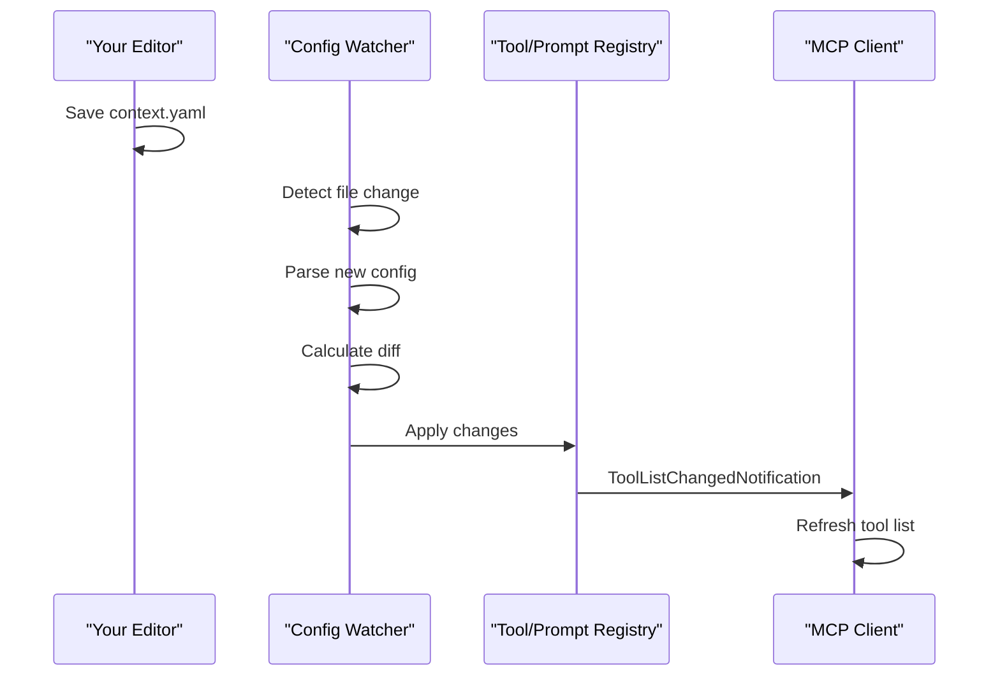

# Hot-Reload Configuration

The MCP Server supports automatic hot-reload of configuration changes. When you modify your `context.yaml` file, the
server detects the changes and updates tools, prompts, and resources without requiring a restart.

## Overview

Hot-reload eliminates the need to restart the MCP server when making configuration changes. This is especially useful
during development when you're iterating on custom tools or prompts.

### Benefits

- **No restart required** - Changes are applied automatically within seconds
- **No client reconnection** - MCP clients stay connected during updates
- **Preserves conversation context** - AI assistants maintain their conversation state
- **Rapid iteration** - Test new tools and prompts immediately

## How It Works



1. **File Watching** - The server monitors your configuration files for changes
2. **Change Detection** - When a file is modified, the server calculates what changed
3. **Incremental Updates** - Only the changed items are updated (added, removed, or modified)
4. **Client Notification** - Connected MCP clients receive notifications about the changes

## Configuration

Hot-reload is **enabled by default**. You can configure it using environment variables:

| Variable | Default | Description |
|----------|---------|-------------|
| `MCP_HOT_RELOAD` | `true` | Enable or disable hot-reload |
| `MCP_HOT_RELOAD_INTERVAL` | `2000` | Polling interval in milliseconds |

### Disabling Hot-Reload

To disable hot-reload, set the environment variable before starting the server:

```bash
MCP_HOT_RELOAD=false ctx server
```

Or in your MCP client configuration:

```json
{
  "mcpServers": {
    "ctx": {
      "command": "ctx",
      "args": ["server", "-c", "/path/to/project"],
      "env": {
        "MCP_HOT_RELOAD": "false"
      }
    }
  }
}
```

### Adjusting Poll Interval

If you want faster or slower change detection:

```bash
# Check every 500ms for faster updates
MCP_HOT_RELOAD_INTERVAL=500 ctx server

# Check every 5 seconds for lower CPU usage
MCP_HOT_RELOAD_INTERVAL=5000 ctx server
```

## Watch Strategies

The server automatically selects the best file watching strategy for your platform:

| Strategy | Platform | Description |
|----------|----------|-------------|
| **inotify** | Linux | Kernel-level file system events, zero CPU when idle |
| **Polling** | All platforms | Checks file modification time periodically |

### Linux with inotify

On Linux systems with the `inotify` PHP extension installed, the server uses kernel-level file watching. This is the
most efficient option with virtually no CPU overhead when files aren't changing.

To install the inotify extension:

```bash
pecl install inotify
```

### Polling Fallback

On macOS, Windows, or Linux without inotify, the server falls back to polling. This checks file modification times at
the configured interval (default: 2 seconds).

## What Gets Reloaded

Hot-reload supports the following configuration sections:

| Section | Supported | Notes |
|---------|-----------|-------|
| `tools` | ✅ Yes | Custom tools are added, removed, or updated |
| `prompts` | ✅ Yes | Prompts are added, removed, or updated |
| `documents` | ⚠️ Partial | Document definitions reload, but cached content may persist |

### Example: Adding a New Tool

1. Your server is running with this configuration:

```yaml
tools:
  - id: list-files
    description: List files in directory
    commands:
      - name: ls
        args: ["-la"]
```

2. You add a new tool to `context.yaml`:

```yaml
tools:
  - id: list-files
    description: List files in directory
    commands:
      - name: ls
        args: ["-la"]
  
  - id: disk-usage        # New tool
    description: Show disk usage
    commands:
      - name: df
        args: ["-h"]
```

3. Save the file - within 2-3 seconds:
   - The server detects the change
   - Parses the new configuration
   - Registers the `disk-usage` tool
   - Sends `ToolListChangedNotification` to clients
   - Your AI assistant can now use the new tool

## Error Handling

Hot-reload is designed to be resilient:

### Invalid Configuration

If you save a configuration with syntax errors:
- The server **keeps the previous valid configuration**
- An error is logged for debugging
- No crash or restart required
- Fix the error and save again

### Partial Failures

If one tool fails to register:
- Other tools continue to register normally
- The failed tool is logged
- The server remains operational

## Debouncing

To handle rapid file saves (common with auto-save features), the server implements debouncing:

- Changes are detected immediately
- A 200ms delay is applied before processing
- Multiple rapid saves result in a single reload
- This prevents unnecessary processing during active editing

## Monitoring

You can monitor hot-reload activity in the server logs:

```
[INFO] Starting config watcher
[DEBUG] Config file changes detected: ["/path/to/context.yaml"]
[INFO] Processing config changes
[INFO] Applied changes: tools: 1 added
[DEBUG] Emitted tools list_changed notification
```

## Troubleshooting

### Changes Not Detected

1. **Check if hot-reload is enabled:**
   ```bash
   # Ensure MCP_HOT_RELOAD is not set to false
   echo $MCP_HOT_RELOAD
   ```

2. **Verify file permissions:**
   The server needs read access to your configuration files.

3. **Check the logs:**
   Look for watcher-related messages in the server output.

### High CPU Usage

If you notice high CPU usage with polling:

1. **Increase the poll interval:**
   ```bash
   MCP_HOT_RELOAD_INTERVAL=5000 ctx server
   ```

2. **Install inotify (Linux):**
   ```bash
   pecl install inotify
   ```

3. **Disable hot-reload** if not needed:
   ```bash
   MCP_HOT_RELOAD=false ctx server
   ```

### Client Not Receiving Updates

1. **Verify client supports notifications:**
   Not all MCP clients support `list_changed` notifications.

2. **Check client connection:**
   The client must maintain an active connection to receive notifications.

3. **Refresh manually:**
   Some clients may require manual refresh of the tool list.

## Best Practices

1. **Use version control** - Track your configuration changes with git
2. **Test incrementally** - Add one tool at a time to isolate issues
3. **Monitor logs** - Watch for errors during development
4. **Keep configs valid** - Use IDE schema validation to catch errors before save
