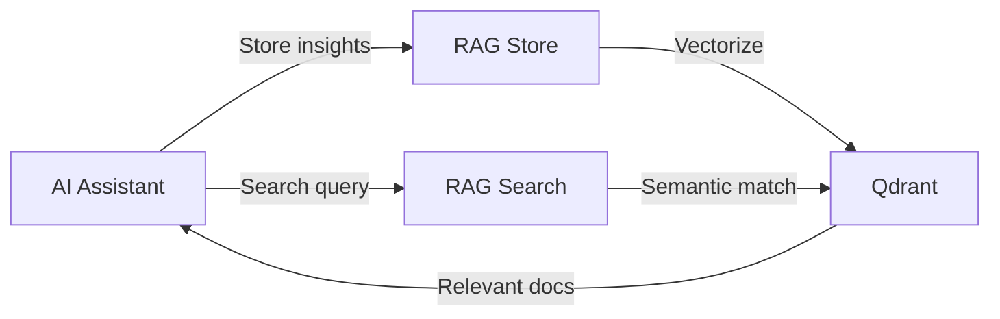

# RAG Knowledge Store

The RAG (Retrieval-Augmented Generation) Knowledge Store allows AI assistants to accumulate project understanding over time. Instead of re-learning your codebase from scratch each session, Claude can store insights, documentation, and explanations that persist across conversations.

## Overview

The RAG system provides:

- **Persistent Knowledge** — Store documentation, code explanations, and architectural insights
- **Semantic Search** — Find relevant information using natural language queries
- **Contextual Retrieval** — Get project-specific knowledge when needed



## Prerequisites

Before using RAG, you need:

1. **Qdrant** — Vector database for storing embeddings
2. **OpenAI API Key** — For generating embeddings

### Start Qdrant

Using Docker:

```bash
docker run -d -p 6333:6333 -p 6334:6334 \
  -v qdrant_storage:/qdrant/storage \
  qdrant/qdrant
```

Or with Docker Compose:

```yaml
services:
  qdrant:
    image: qdrant/qdrant
    ports:
      - "6333:6333"
      - "6334:6334"
    volumes:
      - qdrant_storage:/qdrant/storage

volumes:
  qdrant_storage:
```

## Configuration

Add the `rag` section to your `context.yaml`:

```yaml
rag:
  enabled: true
  
  store:
    driver: qdrant
    qdrant:
      endpoint_url: ${RAG_QDRANT_URL:-http://localhost:6333}
      api_key: ${RAG_QDRANT_API_KEY:-}
      collection: ${RAG_COLLECTION:-ctx_knowledge}
      embeddings_dimension: 1536
      embeddings_distance: Cosine
  
  vectorizer:
    platform: openai
    model: text-embedding-3-small
    api_key: ${OPENAI_API_KEY}
  
  transformer:
    chunk_size: 1000
    overlap: 200
```

### Configuration Options

#### Store Configuration

| Option | Type | Default | Description |
|--------|------|---------|-------------|
| `driver` | string | `qdrant` | Vector store backend (`qdrant`, `memory`) |
| `qdrant.endpoint_url` | string | `http://localhost:6333` | Qdrant server endpoint |
| `qdrant.api_key` | string | - | API key for Qdrant Cloud |
| `qdrant.collection` | string | `ctx_knowledge` | Collection name |
| `qdrant.embeddings_dimension` | int | `1536` | Vector dimensions (must match model) |
| `qdrant.embeddings_distance` | string | `Cosine` | Distance metric (`Cosine`, `Euclid`, `Dot`) |

#### Vectorizer Configuration

| Option | Type | Default | Description |
|--------|------|---------|-------------|
| `platform` | string | `openai` | Embedding platform |
| `model` | string | `text-embedding-3-small` | Embedding model name |
| `api_key` | string | - | API key for the platform |

#### Transformer Configuration

| Option | Type | Default | Description |
|--------|------|---------|-------------|
| `chunk_size` | int | `1000` | Maximum chunk size in characters |
| `overlap` | int | `200` | Overlap between chunks |

### Environment Variables

| Variable | Description |
|----------|-------------|
| `OPENAI_API_KEY` | OpenAI API key for embeddings |
| `RAG_QDRANT_URL` | Qdrant server endpoint |
| `RAG_QDRANT_API_KEY` | Qdrant API key (for cloud) |
| `RAG_COLLECTION` | Collection name |

## MCP Tools

When RAG is enabled, three MCP tools become available:

### rag-store

Store documentation, code explanations, or insights in the knowledge base.

**Parameters:**

| Parameter | Type | Required | Description |
|-----------|------|----------|-------------|
| `content` | string | Yes | Content to store |
| `type` | string | No | Document type (see below) |
| `sourcePath` | string | No | Source path (e.g., `src/Auth/Service.php`) |
| `tags` | string | No | Comma-separated tags |

**Document Types:**

- `architecture` — System design, patterns, relationships
- `api` — API documentation, endpoints, contracts
- `testing` — Test strategies, coverage, patterns
- `convention` — Coding standards, naming conventions
- `tutorial` — How-to guides, walkthroughs
- `reference` — Quick reference, cheat sheets
- `general` — Default, general documentation

**Example:**

```
Store this insight about the authentication system:
- Uses JWT tokens with 24h expiry
- Refresh tokens stored in Redis
- Rate limiting: 100 requests/minute
```

### rag-search

Search the knowledge base using natural language.

**Parameters:**

| Parameter | Type | Required | Default | Description |
|-----------|------|----------|---------|-------------|
| `query` | string | Yes | - | Search query |
| `type` | string | No | - | Filter by document type |
| `sourcePath` | string | No | - | Filter by path prefix |
| `limit` | int | No | 10 | Maximum results (1-50) |

**Example:**

```
Search the knowledge base for "authentication flow"
```

### rag-manage

View knowledge base statistics and configuration.

**Parameters:**

| Parameter | Type | Required | Description |
|-----------|------|----------|-------------|
| `action` | string | Yes | Action to perform (`stats`) |

**Example:**

```
Show RAG knowledge base status
```

## CLI Commands

### rag:status

Display knowledge base status and configuration:

```bash
ctx rag:status

# Output as JSON
ctx rag:status --json
```

### rag:index

Bulk index files from a directory:

```bash
# Index markdown files
ctx rag:index docs

# Index PHP files with type
ctx rag:index src -p "*.php" -t architecture

# Dry run — see what would be indexed
ctx rag:index docs --dry-run

# Non-recursive
ctx rag:index docs/api --no-recursive
```

**Options:**

| Option | Short | Default | Description |
|--------|-------|---------|-------------|
| `--pattern` | `-p` | `*.md` | File pattern |
| `--type` | `-t` | `general` | Document type |
| `--recursive` | `-r` | `true` | Recursive search |
| `--dry-run` | - | `false` | Preview without indexing |

### rag:clear

Clear all entries from the knowledge base:

```bash
# Interactive confirmation
ctx rag:clear

# Force without confirmation
ctx rag:clear -f
```

### rag:reindex

Atomic clear + reindex operation:

```bash
# Reindex documentation
ctx rag:reindex docs -t reference

# Force reindex
ctx rag:reindex docs -f
```

## Usage Patterns

### Initial Setup

1. Configure RAG in `context.yaml`
2. Start Qdrant
3. Index existing documentation:

```bash
# Index your docs
ctx rag:index docs -t reference

# Index architecture docs
ctx rag:index docs/architecture -t architecture
```

### During Development

As you work with Claude, it can store insights:

```
Store this: The PaymentService uses the Strategy pattern 
for different payment providers. Each provider implements 
PaymentProviderInterface with process() and refund() methods.
```

Later, retrieve that knowledge:

```
Search for "payment provider pattern"
```

### Building Knowledge Over Time

Encourage Claude to document discoveries:

- Architecture decisions
- Code patterns and conventions
- API behaviors
- Edge cases and gotchas
- Integration details

## Best Practices

### Document Types

Use appropriate types for better retrieval:

- `architecture` — For system design, component relationships
- `api` — For endpoint documentation, request/response formats
- `convention` — For coding standards, naming patterns
- `tutorial` — For step-by-step guides

### Tags

Use tags for cross-cutting concerns:

```
Store with tags: auth, security, jwt
```

### Source Paths

Link knowledge to code:

```
Store for sourcePath: src/Payment/PaymentService.php
```

### Chunking Settings

Adjust based on content type:

- **Code explanations**: Smaller chunks (500-800 chars)
- **Documentation**: Medium chunks (1000-1500 chars)
- **Tutorials**: Larger chunks (1500-2000 chars)

## Troubleshooting

### Connection Issues

```
Error: Failed to connect to Qdrant
```

**Solution:** Ensure Qdrant is running:

```bash
docker ps | grep qdrant
curl http://localhost:6333/health
```

### Embedding Errors

```
Error: OpenAI API error
```

**Solution:** Check your API key:

```bash
echo $OPENAI_API_KEY
```

### Empty Results

If searches return no results:

1. Check if data was indexed: `ctx rag:status`
2. Verify collection exists in Qdrant
3. Try broader search terms

### Dimension Mismatch

```
Error: Vector dimension mismatch
```

**Solution:** The `embeddings_dimension` must match the model:

- `text-embedding-3-small`: 1536
- `text-embedding-3-large`: 3072
- `text-embedding-ada-002`: 1536

## Architecture

The RAG system uses [Symfony AI Store](https://github.com/symfony/ai-store) as its foundation:

```
rag/
├── Config/                 # RagConfig, StoreConfig, VectorizerConfig
├── Console/                # CLI commands
├── Document/               # DocumentType, MetadataFactory
├── Loader/                 # FileSystemLoader
├── MCP/Tools/              # rag-store, rag-search, rag-manage
├── Service/                # IndexerService, RetrieverService
├── Store/                  # StoreFactory
├── Vectorizer/             # VectorizerFactory
├── RagBootloader.php
├── RagParserPlugin.php
└── RagRegistry.php
```
